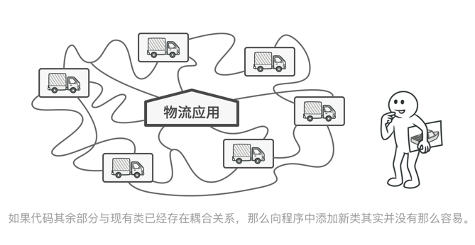
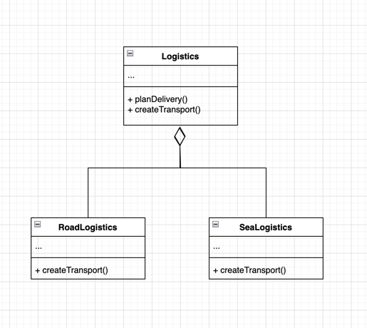
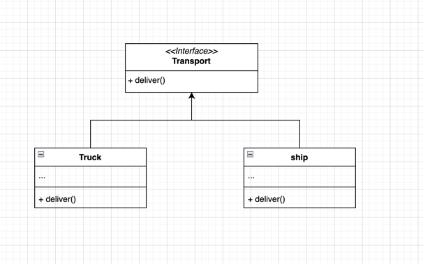
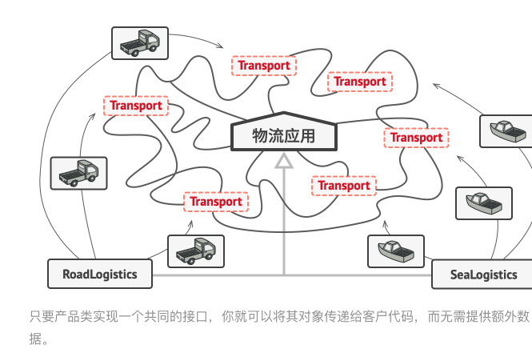
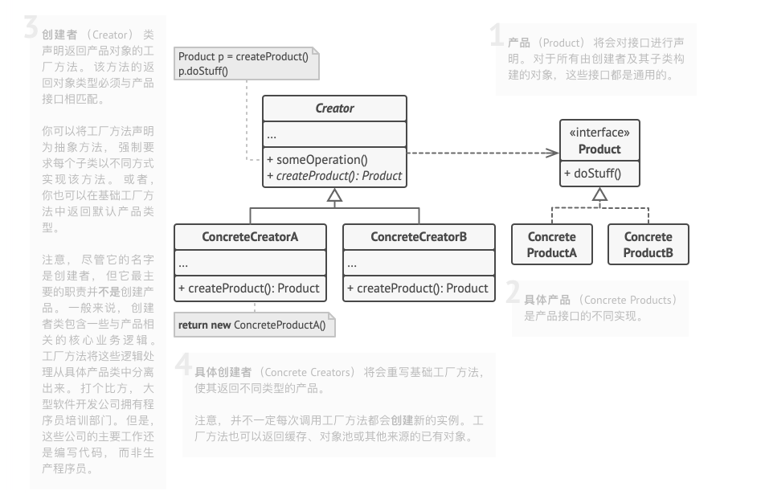

# 重学设计模式

本项目只是为了更好的理解学习《[重学设计模式](https://refactoringguru.cn/design-patterns)》

## 设计模式是什么

设计模式是软件设计中常见问题的典型解决方案。 它们就像能根据需求进行调整的预制蓝图， 可用于解决代码中反复出现的设计问题。
设计模式与方法或库的使用方式不同， 你很难直接在自己的程序中套用某个设计模式。 模式并不是一段特定的代码， 而是解决特定问
题的一般性概念。 你可以根据模式来实现符合自己程序实际所需的解决方案。 人们常常会混淆模式和算法， 因为两者在概念上都是已
知特定问题的典型解决方案。 但算法总是明确定义达成特定目标所需的一系列步骤， 而模式则是对解决方案的更高层次描述。 同一模
式在两个不同程序中的实现代码可能会不一样。 算法更像是菜谱： 提供达成目标的明确步骤。 而模式更像是蓝图： 你可以看到最终
的结果和模式的功能， 但需要自己确定实现步骤。

## 设计模式分类

设计模式通常被分为三大类： 创建型模式、 结构型模式和行为型模式。

### 创建型模式

创建型模式关注类和对象的创建机制， 封装了对象的创建过程， 使得程序在创建对象时具有更高的灵活性。 这类模式主要包括： 单例
模式、 工厂方法模式、 抽象工厂模式、 建造者模式、 原型模式。

#### 工厂模式

工厂模式（Factory Pattern）是一种创建型设计模式， 它提供了一种创建对象的方式， 而无需指定具体的类。 工厂模式通过定义一
个工厂接口和多个工厂实现类， 将对象的创建过程封装在工厂类中， 客户端只需要调用工厂类的方法即可创建对象， 而无需关心对象的
创建细节。 工厂模式的主要优点是解决了对象的创建和使用之间的耦合问题， 提高了代码的可维护性和可扩展性。

##### 思考问题

假设你正在开发一款物流管理应用。 最初版本只能处理卡车运输， 因此大部分代码都在位于名为***卡车***的类中。
一段时间后， 这款应用变得极受欢迎。 你每天都能收到十几次来自海运公司的请求， 希望应用能够支持海上物流功能。

这可是个好消息。 但是代码问题该如何处理呢？ 目前， 大部分代码都与 ***卡车***类相关。 在程序中添加 ***轮船***类需要修改全
部代码。 更糟糕的是， 如果你以后需要在程序中支持另外一种运输方式， 很可能需要再次对这些代码进行大幅修改。
最后， 你将不得不编写繁复的代码， 根据不同的运输对象类， 在应用中进行不同的处理。

##### 解决方案

工厂模式提供了一种解决方案。 你可以将所有车辆创建代码移至一个工厂类中， 然后为每种车辆类型创建一个工厂子类。 这样， 添加新
的车辆类型将不再需要修改现有代码， 只需为新的车辆类型创建新的工厂子类即可。



乍看之下， 这种更改可能毫无意义： 我们只是改变了程序中调用构造函数的位置而已。 但是， 仔细想一下， 现在你可以在子类中重写工厂方法，
从而改变其创建产品的类型。

但有一点需要注意:仅当这些产品具有共同的基类或者接口时， 子类才能返回不同类型的产品， 同时基类中的工厂方法还应将其返回类型声明为这一共有接口。


举例来说， 卡车（Truck）和 轮船（Ship）类都必须实现 运输Transport接口， 该接口声明了一个名为 deliver交付的方法。
每个类都将以不同的方式实现该方法： 卡车走陆路交付货物， 轮船走海路交付货物。
陆路运输（RoadLogistics）类中的工厂方法返回卡车对象， 而 海路运输（SeaLogistics）类则返回轮船对象。



调用工厂方法的代码 （通常被称为客户端代码） 无需了解不同子类返回实际对象之间的差别。 客户端将所有产品视为抽象的 运输 。 客户端知道所有运输对象都提供 交付方法， 但是并不关心其具体实现方式。
##### 工厂模式结构


伪代码
```java
// 运输接口。
interface Transport { void deliver(); }
// 具体产品类。
class Truck implements Transport { ... } class Ship implements Transport { ... }
// 抽象工厂接口。
interface LogisticsFactory { Transport createTransport(); }
// 具体工厂类。
class RoadLogistics implements LogisticsFactory { Transport createTransport() { return new Truck(); } }
class SeaLogistics implements LogisticsFactory { Transport createTransport() { return new Ship(); } }
// 客户端代码。
class Client { private LogisticsFactory factory; Client(LogisticsFactory factory) { this.factory = factory; } void deliver() { Transport transport = factory.createTransport(); transport.deliver(); } }
```
